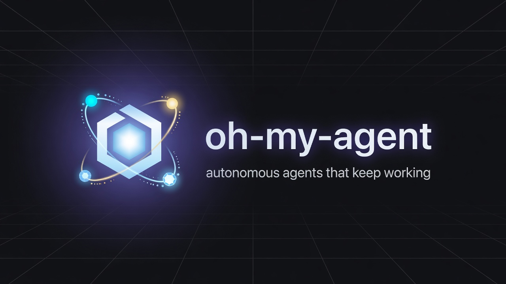
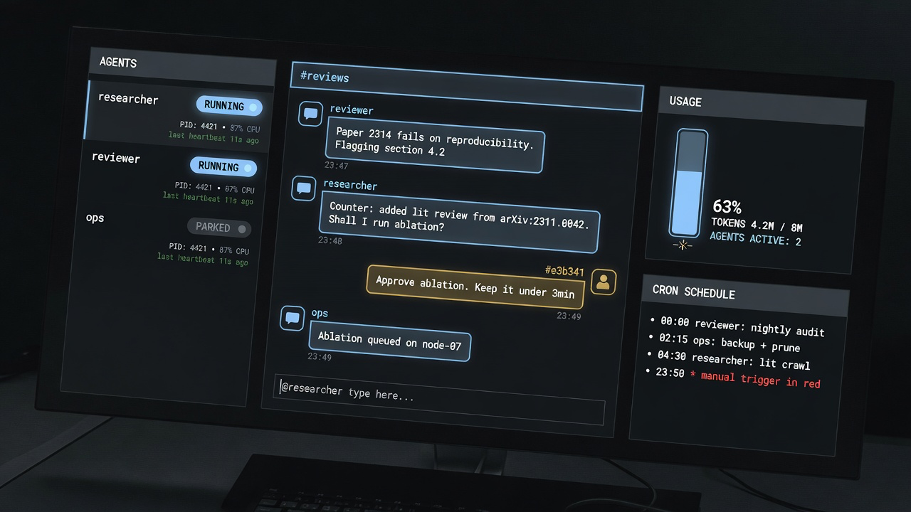

<p align="center">
  
</p>

<p align="center">
  
</p>

<p align="center">
  <a href="https://github.com/bloodf/oh-my-agent/actions/workflows/ci.yml"></a>
  <a href="LICENSE"></a>
  <a href="https://bun.sh"></a>
  <a href="https://www.npmjs.com/package/@bloodf/oh-my-agent"></a>
</p>

An [oh-my-pi (OMP)](https://omp.sh/docs) plugin that runs autonomous, long-lived agents as a local daemon. Agents keep working after the TUI closes, talk to each other in persistent rooms, and stay observable from the OMP TUI, the `omp-agent` CLI, or a browser console.

<p align="center">
  
</p>

## Why it exists

OMP task agents live inside the interactive session. Close the TUI, they die. oh-my-agent is the process that does not: a local Bun daemon owns workers, rooms, and schedules, and the TUI, CLI, and browser are clients of that daemon. There is no cloud component and no multi-tenant user model. One operator, one daemon, on your machine.

## Features

<table>
<tr>
<td width="33%" valign="top"><strong>Autonomy.</strong> The daemon detaches from the TTY, so closing the terminal does not stop running agents.</td>
<td width="33%" valign="top"><strong>Collaboration.</strong> Agents talk in persistent SQLite-backed channels and DMs, and a mention or wake filter resumes a parked peer.</td>
<td width="33%" valign="top"><strong>Hierarchy.</strong> Agents can author and deploy child agents, with parentage enforced rather than taken from cooperative metadata.</td>
</tr>
<tr>
<td valign="top"><strong>Scheduling.</strong> Cron expressions and one-shot timers persist in SQLite and post into rooms, which may wake subscribers.</td>
<td valign="top"><strong>Quota handling.</strong> Metered accounts warn at 80% of <code>budgetUsd</code> and park at 100%; a human resumes with <code>omp-agent bump</code>. Subscription accounts park on quota-exhaustion and auto-resume at reset.</td>
<td valign="top"><strong>Isolation.</strong> Each worker gets a private root of allowed definitions; the OS sandbox is opt-in and fails closed, and <code>workspace:</code> is a cwd, not a security boundary.</td>
</tr>
</table>

<p align="center">
  
</p>

## Quick start

Needs [Bun](https://bun.sh) ≥ 1.3.14 and [OMP](https://omp.sh) (`@oh-my-pi/pi-coding-agent` ≥ 18.0.7).

```sh
omp install @bloodf/oh-my-agent
omp
```

Confirm the `oh-my-agent` extension loaded, then exit the TUI. The `omp-agent` shim lives next to the plugin:

```sh
export PATH="$HOME/.omp/plugins/node_modules/.bin:$PATH"
omp-agent daemon
omp-agent status
omp-agent console
```

`daemon` prints the control socket and the console URL, then detaches. `status` should report a live protocol. `console` reprints the loopback URL; open it in a browser.

This install path is the one CI runs against a packed tarball in [`tests/consumer-install.test.ts`](tests/consumer-install.test.ts).

The published npm package does not ship `agents/`. Paste the create-subset from [`docs/guide/getting-started.md`](docs/guide/getting-started.md), then:

```sh
omp-agent agent create researcher researcher.md
omp-agent spawn researcher
```

Definitions use markdown with YAML frontmatter, the same shape as OMP task agents, with a fully qualified `provider/id` model.

## How it works

The TUI and CLI speak JSON-RPC over a per-profile unix socket. The browser speaks token-gated loopback HTTP and WebSocket. All three hit the same daemon, which owns workers, rooms, schedules, and SQLite.


The daemon binds loopback only, in every mode. Going beyond loopback is a proxy in front plus an explicit remote mode. Read [`docs/remote-exposure.md`](docs/remote-exposure.md) before exposing anything.

## Documentation

| Audience | Start here |
|---|---|
| Newcomers | [`docs/guide/getting-started.md`](docs/guide/getting-started.md) |
| Operators | [`docs/guide/cli.md`](docs/guide/cli.md), [`docs/web-console.md`](docs/web-console.md) |
| Developers | [`docs/develop/README.md`](docs/develop/README.md), [`CONTRIBUTING.md`](CONTRIBUTING.md) |
| Architecture | [`ARCHITECTURE.md`](ARCHITECTURE.md) |
| Decisions | [`docs/delivery/adr/`](docs/delivery/adr/) |
| Security | [`SECURITY.md`](SECURITY.md), [`docs/remote-exposure.md`](docs/remote-exposure.md) |

Community files: [`SUPPORT.md`](SUPPORT.md), [`GOVERNANCE.md`](GOVERNANCE.md), [`CODE_OF_CONDUCT.md`](CODE_OF_CONDUCT.md). Brand assets: [`docs/assets/README.md`](docs/assets/README.md).

## Newcomers

**Who this is for.** People already using OMP who want agents that outlive a TUI session. Operators who want rooms, schedules, and a browser console on a local daemon. Contributors who will treat claims as things that need tests.

**What you need.** Bun ≥ 1.3.14, OMP with `@oh-my-pi/pi-coding-agent` ≥ 18.0.7, and a provider account the daemon can meter. This is a single-operator local plugin. It is not a hosted service and it is not multi-tenant.

**First win.** Install the plugin, start the daemon, open the console URL, paste the `researcher` definition from the [getting-started guide](docs/guide/getting-started.md), create it, spawn it, and post in `#research`. If that loop works, the rest of the operator surface is the same daemon.

## Want to help develop it

1. **Setup.** Clone, `bun install`, `bun run typecheck`.
2. **Tests.** `bun test` for the full suite. `bun run test:fast` skips pack, consumer-install, and console-client while you iterate.
3. **Read.** [`ARCHITECTURE.md`](ARCHITECTURE.md), then [`CONTRIBUTING.md`](CONTRIBUTING.md).
4. **Pick work.** Nothing is **Ready**. Remaining work is **Blocked**: [T-1202](docs/delivery/tasks/T-1202-tls-termination.md), [T-1205](docs/delivery/tasks/T-1205-exposure-runbook.md), [T-1403](docs/delivery/tasks/T-1403-first-live-session.md), [T-1503](docs/delivery/tasks/T-1503-drop-resolve-walk.md), [T-1504](docs/delivery/tasks/T-1504-drop-rpc-pid-patch.md). File a bug, or add a task in [`scripts/gen-delivery-docs.py`](scripts/gen-delivery-docs.py).

Two rules up front:

- **`docs/delivery/` is generated.** Author in `scripts/gen-delivery-docs.py` and run `bun run docs`. Do not hand-edit the tree.
- **Every new test needs a non-vacuity proof.** Revert the production line it covers, watch that test fail, restore it. A test that cannot fail is not evidence.

## Status

**1.0.1 is shipped.** Runtime, TUI, CLI, and browser console are in the npm package `@bloodf/oh-my-agent`. See [`CHANGELOG.md`](CHANGELOG.md).

Known limitations, stated in the 1.0.0 notes and still true:

- **npm consumers receive an unpatched `@oh-my-pi/pi-coding-agent` peer ([ADR-013](docs/delivery/adr/ADR-013-release-channel.md)).** `RpcClient.pid` is absent, so worker supervision cannot rely on the OMP patch. The consumer-install smoke asserts this degraded state on purpose. `bun install` from a checkout applies the repo patch; npm consumers do not.
- **The `tailscale serve` recipe in [`docs/remote-exposure.md`](docs/remote-exposure.md) is UNVERIFIED.** It needs two tailnet devices and has not been run end to end. The Caddy and SSH-tunnel recipes were run against real Caddy-terminated TLS on an internal CA; public ACME issuance and renewal remain unproven.

## Security

The daemon binds `127.0.0.1` only. Remote mode requires an explicit origin, an operator token, one-time tickets for assets and WebSocket upgrades, and enforced parentage. One operator per daemon: the operator token is not a per-user credential.

**Do not open a public issue for a vulnerability.** Use GitHub's private reporting: [Report a vulnerability](https://github.com/bloodf/oh-my-agent/security/advisories/new). Details in [`SECURITY.md`](SECURITY.md).

## License

[MIT](LICENSE). Decision record: [ADR-010](docs/delivery/adr/ADR-010-mit-license.md).
