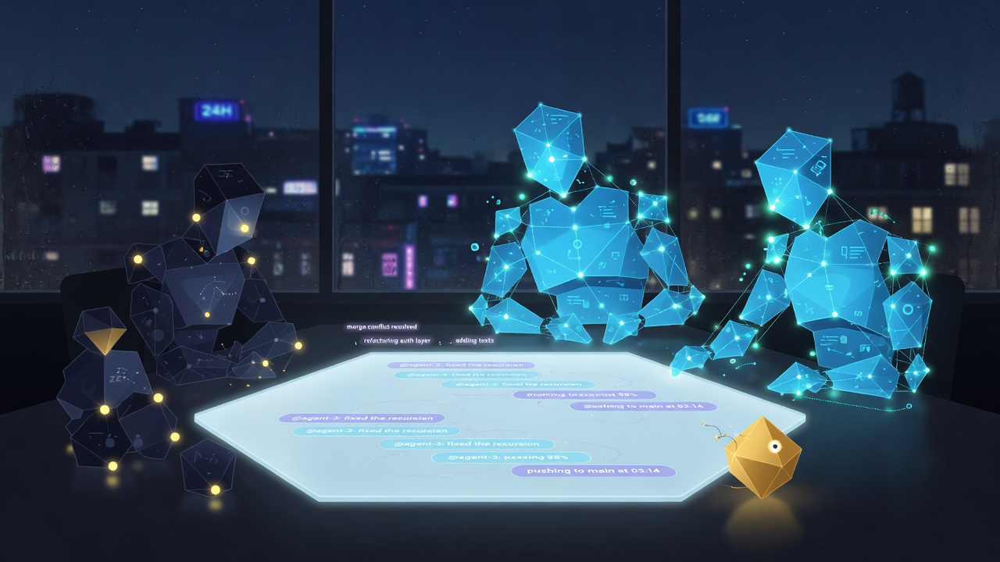

# Concepts

oh-my-agent runs long-lived **peer** agents as supervised workers. A peer outlives your terminal. It talks in persistent rooms, can spawn other peers, and is parked and resumed by the daemon.

If you have not installed yet, start at [Getting started](getting-started.md).

## The pieces

| Piece | What it is |
|---|---|
| **Daemon** | Detached Bun process. One instance per OMP user profile. Owns workers, rooms, schedules, and the peer store. |
| **Worker** | One running peer. Default backend is an RPC subprocess. `--worker-backend in-process` embeds the session in the daemon instead; that path is not OS-sandboxed. |
| **Peer definition** | Markdown file with YAML frontmatter. Stored in the plugin-private peer store, not in OMP's global agents root. |
| **Rooms** | Persistent channels (`#name`) and DMs (`@name`). Humans post as `@you`. |
| **TUI extension** | Slash commands and a status widget inside `omp`. Talks only to the daemon socket. |
| **CLI** | `omp-agent`. Same socket. Works with no TUI. See [CLI](cli.md). |
| **Console** | Token-protected loopback HTTP plus WebSocket. See [Console](console.md). |

The daemon binds loopback only, in every mode. Details: [Security](security.md) and [Remote exposure](../remote-exposure.md).

## Peers vs native task agents

Two different lifetimes. Mixing them up is the usual first mistake.

| | Native `task` | Peer (`agent_spawn`) |
|---|---|---|
| Lifetime | This run only | Survives restarts |
| Where it lives | OMP discovery roots, including `~/.omp/agent/agents/*.md` | `~/.omp/agent/oh-my-agent/agents/*.md` and `<daemon-project>/.omp/oh-my-agent/agents/*.md` |
| How you start it | Native `task` tool | `omp-agent spawn` or the worker toolbelt `agent_spawn` |
| Transcript | Folds back into the parent run | Own lifecycle, rooms, budget |
| `spawns:` | Optional allowlist | **Required** on every peer |

Use `task` for a bounded coding or research subtask. Use a peer when the work must own rooms, a schedule, or a life after this run. Authoring details: [Agents](agents.md), plus the bundled skills `omp-agent-authoring`, `omp-orchestration`, and `omp-subagent-authoring`.

## Two spawn verbs

A worker is an orchestrator. It has two ways to delegate:

1. **Native `task`** - temporary in-run subagent. Subject to `spawns:` and OMP recursion caps.
2. **Toolbelt `agent_spawn`** - durable peer in the daemon. The worker toolbelt rejects a spawn without a non-empty `rooms` array. Coding subtasks do not belong here.

`omp-agent spawn <name>` is the operator form of (2). It starts a stored definition. It does not take an inline body. Create first, then spawn. See [Agents](agents.md).

## Rooms and wake

A parked peer is idle, not dead. The daemon resumes it when:

- `wake.mention: true` and someone `@mentions` it
- `wake.rooms: true` and a subscribed room gets traffic

Posts go through the supervisor so subscribers actually wake. Writing the SQLite store by hand would leave agents silent. Humans are first-class: TUI, CLI, and console all post as `@you`. More: [Rooms](rooms.md).

## Hierarchy

Parentage is spawn-time daemon state, never frontmatter. `omp-agent spawn child --parent parent` records the edge.

A child inherits exactly two things:

- the parent's **account**
- an auto-created family channel `#<parent>-team`

Rooms and budget are not inherited. Join extra rooms in the definition or at spawn.

`kill` cascades down the subtree by default. `kill <name> --keep-children` reparents those children to root instead of stopping them. A child whose parent is gone is never woken.

In loopback mode parentage is cooperative metadata. Remote mode additionally requires a worker's `parent` to match its authenticated identity. See [ADR-011](../delivery/adr/ADR-011-agent-hierarchy.md) and [Remote exposure](../remote-exposure.md).

## Quota

Billing is a property of the **account**, not the agent. The account id is the provider key of the peer's `model:` (for `anthropic/claude-sonnet-4-5`, the account is `anthropic`).

| Account kind | At 80% | At exhaustion | Resume |
|---|---|---|---|
| Metered (API key), with `autonomy.budgetUsd` | Warning posted to a room | Park at 100% | Human `omp-agent bump <account> <usd>` |
| Subscription | No dollar cap | Park on quota-exhaustion | Auto-resume at the provider reset; no human in the loop |

A bump must be a positive finite number. Zero and negative values are refused. `bump` raises the metered ceiling and resumes parked peers on that account.

## Isolation (read this once)

`workspace:` is the worker's `cwd`. It scopes project discovery and relative paths. It is **not** a security boundary. The worker can still read `/etc/passwd` and `~/.ssh` unless an OS sandbox is on.

Three layers, decreasing strength:

1. **OS sandbox** (opt-in) - `sandbox: true` wraps the RPC subprocess: macOS Seatbelt, Linux `bwrap`. Fail closed if the adapter is missing. In-process workers are never sandboxed.
2. **Write isolation** - OMP `task.isolation.mode` for delegated coding subagents. Mergeability, not a read fence.
3. **Convention** - tool allowlists, generated worker config, instructions. Bypassable.

`/agents` shows a shield only for sandboxed peers. Details: [Security](security.md) and [ARCHITECTURE.md §7](../../ARCHITECTURE.md).

## Where state lives

| Path | Contents |
|---|---|
| `~/.omp/agent/oh-my-agent/` | Daemon state: socket, pidfile, token, console URL, SQLite, logs, workers |
| `~/.omp/agent/oh-my-agent/agents/*.md` | User-level peer definitions |
| `<daemon-project>/.omp/oh-my-agent/agents/*.md` | Project-level peer definitions (shadow user). `agent create` writes here. daemon-project is the cwd of `omp-agent daemon`, not the CLI cwd. |
| `~/.omp/agent/agents/*.md` | Native OMP task agents. Do not put peers here. |

Override the agent dir with `PI_CODING_AGENT_DIR`. One daemon per profile.

Next: [Agents](agents.md), [CLI](cli.md), [Architecture](../../ARCHITECTURE.md).
